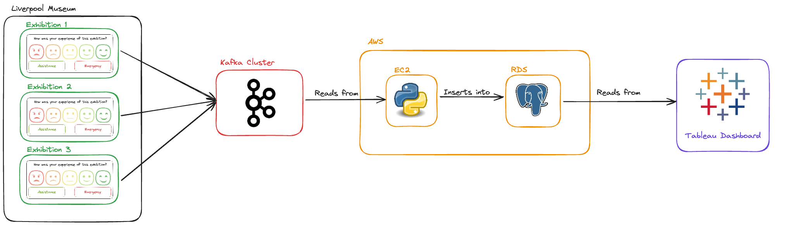
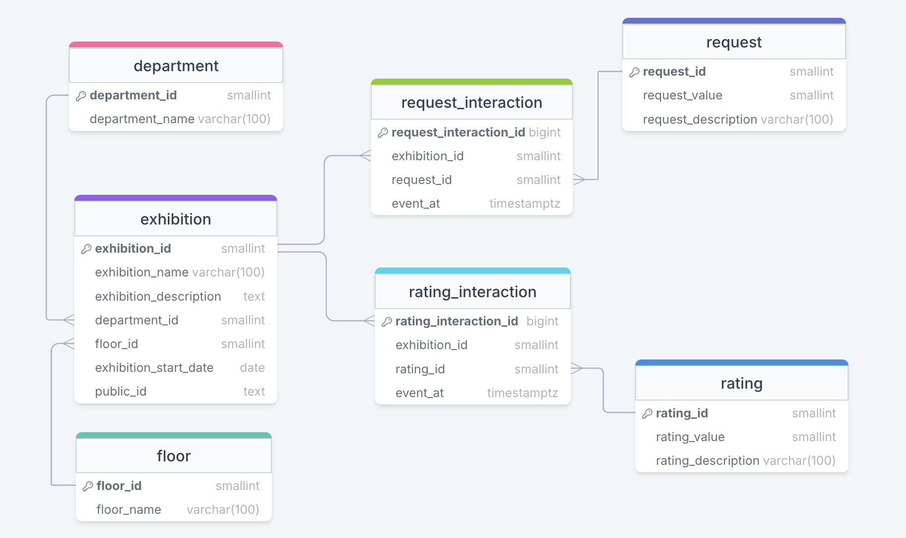

# **Data Pipeline - Live Kiosk Data**  


## Overview
This coursework demonstrates a data pipeline designed to process and analyse real-time data from kiosks at museum exhibits. The pipeline receives user interactions from a kiosk, streams the data with Kafka, processes it in an EC2 instance running the `live_pipeline.py` script. This cleaned data is then stored in a PostgreSQL RDS database, which can then be displayed in a Tableau dashboard for analysis.




## 🗂️ terraform_ec2_config
Creates the EC2 instance through terraform - run `createEc2.sh` and type 'yes' to confirm. Run `ec2.sh` to connect to the EC2 instance.

Files: `main.tf` `createEc2.sh` `ec2.sh` `.env` `.pemkey`

### ⚙️ Environment requirements - `.env`
```sh
EC2_IPV4=#ec2_ip_address
```


## 🗂️ terraform_rds_config
Creates the RDS instance through terraform - run `createRds.sh` and type 'yes' to confirm.


Files: `main.tf` `output.tf` `variables.tf` `createRds.sh` `terraform.tfvars`

### ⚙️ Requirements - `terraform.tfvars`
``` sh
db_username = "your_database_user"
db_password = "your_database_password"
```


## 🗂️ pipeline
This directory contains the main pipeline scripts that process the live kiosk data using `live_pipeline.py`. The schema is defined and seeded in `schema.sql` which can be initialised or reset using `reset_db.sh`



Files: `live_pipeline.py` `test_pipeline.py` `schema.sql` `reset_db.sh` `.env`


### ⚙️ Environment requirements - `.env`
### Kafka Config
```sh
BOOTSTRAP_SERVERS=#your_kafka_bootstrap_servers
SECURITY_PROTOCOL=#SASL_SSL
SASL_MECHANISMS=#PLAIN
USERNAME=#your_kafka_username
PASSWORD=#your_kafka_password
```
### PostgreSQL Database
```sh
DB_HOST=#your_database_host
DB_NAME=#your_database_name
DB_USER=#your_database_user
DB_PASSWORD=#your_database_password
DB_PORT=#your_db_port (default is 5432)
```